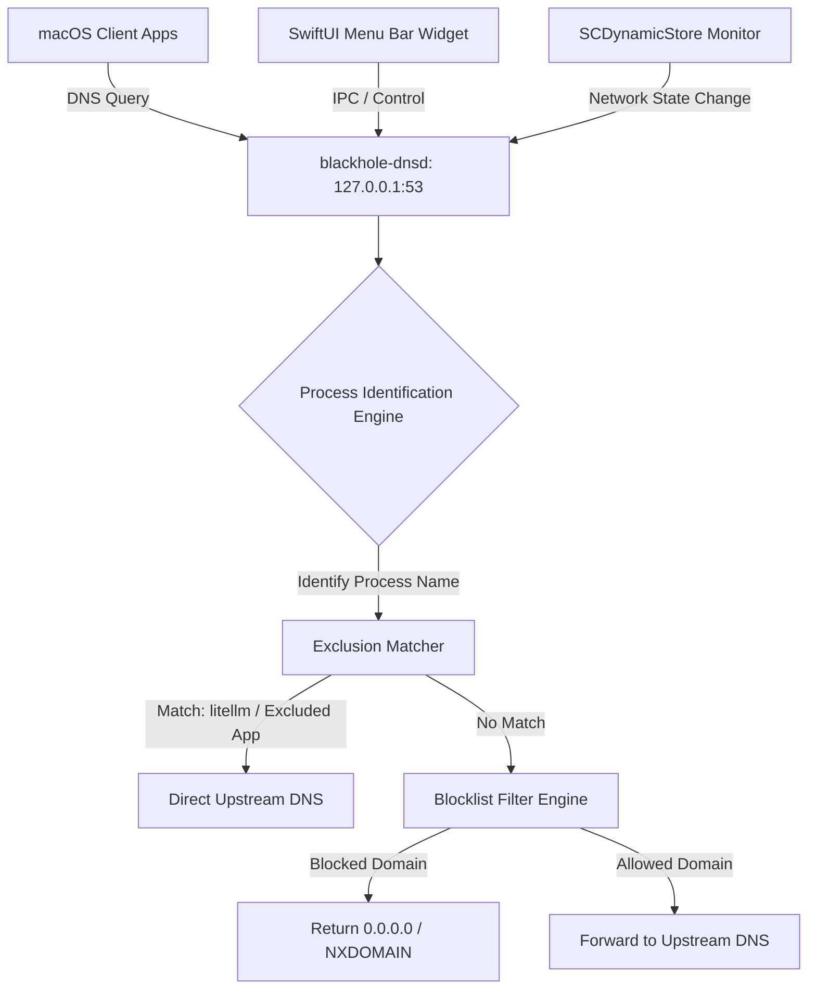
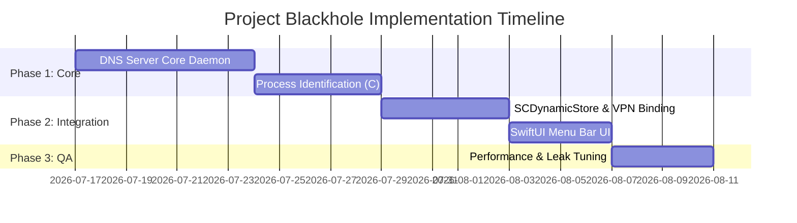

# Technical Specification: Native Local DNS Ad-Blocker for macOS (Project Blackhole)

## 1. Executive Summary & Context
This specification outlines the design of **Project Blackhole**, a lightweight, native local DNS ad-blocking system for macOS (specifically targeting macOS 15+ "Tahoe"). It achieves the outcome described in the reference Reddit thread (running a local ad-blocking DNS server similar to Pi-hole) but addresses the severe resource constraints, container networking limitations, and VPN stack compatibility issues of running Docker on macOS.

### Core Objectives
1. **Ultra-Low Resource Footprint**: Bypasses heavy Docker Desktop/VM virtualization, targeting <35MB total system RAM and ~0% idle CPU.
2. **Process-Level Exclusions**: Excludes LiteLLM and user-defined applications from DNS filtering by correlating UDP/TCP source ports to macOS process names/paths.
3. **VPN Compatibility**: Operates seamlessly alongside native macOS VPN stacks by monitoring dynamic interfaces and chaining DNS resolution.
4. **Native macOS UX**: A lightweight SwiftUI Menu Bar widget that manages the lifecycle of the DNS daemon, handles manual activation, and provides a graphical interface for app-level exclusions.

---

## 2. System Architecture

Project Blackhole is split into two primary components:
1. **`blackhole-dnsd`**: A user-space DNS proxy daemon written in Go or Rust.
2. **`Blackhole Menu Bar`**: A native macOS menu bar app written in Swift/SwiftUI.



---

## 3. Component Deep Dive

### 3.1. Core DNS Daemon (`blackhole-dnsd`)
The daemon runs as a local background process (managed by `launchd` or initiated by the Menu Bar app).

* **Socket Listeners**: Listens on `127.0.0.1:53` for UDP and TCP traffic.
* **Blocklist Matching**: Loads a gravity-compatible blocklist format (flat hosts files or domain lists) into an in-memory Trie (Prefix Tree) structure to ensure $O(L)$ lookup times, where $L$ is the length of the domain name.
* **Upstream Forwarders**: Configured with primary public forwarders (e.g., `1.1.1.1`, `8.8.8.8`) and dynamically updated VPN forwarders.

### 3.2. Dynamic Process Identification Module
Because standard DNS queries sent over localhost loops do not carry PID metadata, `blackhole-dnsd` maps connections to processes out-of-band:

1. On receiving a packet, extract the sender's ephemeral port ($P_{source}$).
2. Query the macOS Kernel socket-to-process table using the `proc_pidinfo` API with `PROC_PIDINVERSION` or parsing via `<libproc.h>` socket structures:
   ```c
   // High-level conceptual C logic used by the daemon
   struct socket_fdinfo si;
   int res = proc_pidfdinfo(pid, fd, PROC_PIDFDCONNECTIONINFO, &si, sizeof(si));
   ```
3. Resolve the Process ID (PID) to the executable path and bundle identifier:
   * **Application**: `/Applications/Slack.app/Contents/MacOS/Slack` -> Bundle ID: `com.tinyspeck.slackmacgap`.
   * **LiteLLM**: `/usr/local/bin/python3` (with arguments matching `litellm` or direct executable path `/usr/local/bin/litellm`).
4. **Caching Layer**: Since resolving process paths via syscalls for every packet introduces latency, the daemon maintains a thread-safe LRU cache:
   * **Key**: `SourcePort` (UInt16)
   * **Value**: `{ ProcessName: String, BundleID: String, ResolvedAt: Timestamp }`
   * **TTL**: 5 seconds (sufficient for DNS transaction lifetimes).

### 3.3. macOS VPN Stack Compatibility Layer
When a macOS native VPN (IKEv2, Cisco IPSec, WireGuard) connects, it modifies system routing tables and DNS configurations. `blackhole-dnsd` maintains compatibility by:

1. **System Configuration Monitoring**: Using the macOS `SystemConfiguration.framework` API (via `SCDynamicStore`) to subscribe to network state keys:
   * `State:/Network/Global/DNS`
   * `State:/Network/Interface`
2. **Interface Detection**: When a VPN interface (e.g. `utun*`, `ipsec*`) is established, the daemon extracts the VPN DNS servers from the System Configuration key.
3. **Conditional DNS Chaining**:
   * Internal/Private domains (e.g., `*.corp.internal`, `*.lan`) are routed directly to the VPN DNS server.
   * Public domains are routed to public DNS forwarders (ad-blocked) or bypassed if they match the exclusion list.
4. **DNS Priority Lock**: The daemon programmatically ensures that `127.0.0.1` remains set as the primary DNS server on all active physical interfaces (Wi-Fi, Ethernet) to prevent the VPN from fully overriding the local loopback DNS.

---

## 4. Constraint Mapping & Implementation Specs

| Constraint | Solution / Implementation Spec | Verification / Evidence Metric |
| :--- | :--- | :--- |
| **Minimal Memory & CPU** | Core daemon compiled to native binary (Go or Rust) without VM. UI built in native SwiftUI. | Total RAM < 35MB (Daemon <15MB, Widget <20MB). Idle CPU < 0.1%. |
| **Menu Bar Widget** | Native macOS `MenuBarExtra` application running in user space. | Interactive menu bar item present in macOS Menu Bar. |
| **Manual Activation** | Widget is added to Login Items, but local DNS proxying defaults to `Inactive`. Toggling `Active` invokes `networksetup -setdnsservers` or uses `SCPreferences` API to set loopback DNS. | System DNS settings point to `127.0.0.1` only when activated manually. |
| **VPN Compatibility** | Monitors `SCDynamicStore` for `utun` changes and chains resolution to VPN DNS. | Resolution of internal corporate domains succeeds while VPN is active. |
| **LiteLLM Exclusion** | Process Identification Module intercepts queries originating from `litellm` process name and bypasses the Trie filter. | LiteLLM traffic (queries to OpenAI/Anthropic/Gemini) does not appear in blocked logs. |
| **App Exclusion List** | Popover UI Tab reads/writes `exclusions.json`. Daemon polls file modifications and updates exclusion filters in real-time. | Adding `com.spotify.client` to the widget tab immediately permits Spotify-related ad domains. |

---

## 5. UI Layout Specification

The Menu Bar Popover utilizes a clean, macOS-native tabbed interface styled to fit Tahoe's visual language.

### Popover View Structure
```
+------------------------------------------+
| Blackhole DNS                  [Active]  |
+------------------------------------------+
|  [ Status & Stats ]    [ App Exclusions ]|
+------------------------------------------+
|                                          |
|  Add Excluded Application:               |
|  [ Enter App Name / Bundle ID     ] (+)  |
|                                          |
|  Currently Excluded:                     |
|  [x] litellm                             |
|  [x] com.spotify.client                  |
|  [x] com.tinyspeck.slackmacgap           |
|                                          |
|                                [Save]    |
+------------------------------------------+
```

* **Data Schema (`exclusions.json`)**:
  ```json
  {
    "excluded_processes": ["litellm", "python3"],
    "excluded_bundle_ids": [
      "com.spotify.client",
      "com.tinyspeck.slackmacgap"
    ],
    "custom_domains_bypass": [
      "api.openai.com",
      "api.anthropic.com"
    ]
  }
  ```

---

## 6. Implementation Stages & Risk Analysis



### Risk Analysis & Mitigation
* **Risk 1: Dynamic Source Port Lifetime**: A process might spawn a DNS socket, query, and close it before `proc_pidinfo` is executed.
  * *Mitigation*: Fallback to wildcard domain whitelists for known LLM endpoints if the socket lookup returns a missing PID (e.g., if query lookup fails, check against `custom_domains_bypass` as a fallback).
* **Risk 2: macOS Permissions & Sandbox**: A sandboxed SwiftUI widget cannot execute low-level process queries or modify global system DNS configurations.
  * *Mitigation*: The Menu Bar UI runs sandboxed, but communicates via XPC to a privileged helper tool (`com.solution8.blackhole.helper`) or utilizes a non-sandboxed helper daemon installed in `/usr/local/bin/` running under launchd permissions.
